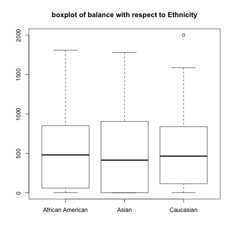
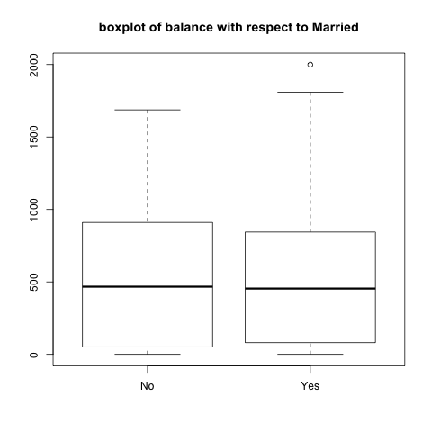

```{r, eval = TRUE, echo = FALSE, message = FALSE, warning=FALSE}
library(png)
library(grid)
library(gridExtra)
library(xtable)
load("../data/eda-text-output.RData")
```

# Data
The `Credit.csv` dataset consists of `balance` observations (average credit card debt) 
for 400 different individuals, as well as observations for a number of quantitative 
and qualitative variables detailed below: 
  
## Quantitative Variables
* `age`  
* `cards` (number of credit cards)  
* `education` (years of education)  
* `income`(in thousands of dollars)  
* `limit` (credit limit)  
* `rating` (credit rating) 
  
A very general overview of the distribution for each variable is provided in the 
histograms and boxplots below: 

```{r, eval = TRUE, echo = FALSE, message = FALSE, fig.width = 9, fig.height = 9}
age_hist <- rasterGrob(as.raster(readPNG("../images/quantitative/histograms/histogram-age.png")), interpolate = FALSE)
age_bp <- rasterGrob(as.raster(readPNG("../images/quantitative/boxplots/boxplot-age.png")), interpolate = FALSE)
balance_hist <- rasterGrob(as.raster(readPNG("../images/quantitative/histograms/histogram-balance.png")), interpolate = FALSE)
balance_bp <- rasterGrob(as.raster(readPNG("../images/quantitative/boxplots/boxplot-balance.png")), interpolate = FALSE)
cards_hist <- rasterGrob(as.raster(readPNG("../images/quantitative/histograms/histogram-cards.png")), interpolate = FALSE)
cards_bp <- rasterGrob(as.raster(readPNG("../images/quantitative/boxplots/boxplot-cards.png")), interpolate = FALSE)
education_hist <- rasterGrob(as.raster(readPNG("../images/quantitative/histograms/histogram-education.png")), interpolate = FALSE)
education_bp <- rasterGrob(as.raster(readPNG("../images/quantitative/boxplots/boxplot-education.png")), interpolate = FALSE)
income_hist <- rasterGrob(as.raster(readPNG("../images/quantitative/histograms/histogram-income.png")), interpolate = FALSE)
income_bp <- rasterGrob(as.raster(readPNG("../images/quantitative/boxplots/boxplot-income.png")), interpolate = FALSE)
limit_hist <- rasterGrob(as.raster(readPNG("../images/quantitative/histograms/histogram-limit.png")), interpolate = FALSE)
limit_bp <- rasterGrob(as.raster(readPNG("../images/quantitative/boxplots/boxplot-limit.png")), interpolate = FALSE)
rating_hist <- rasterGrob(as.raster(readPNG("../images/quantitative/histograms/histogram-rating.png")), interpolate = FALSE)
rating_bp <- rasterGrob(as.raster(readPNG("../images/quantitative/boxplots/boxplot-rating.png")), interpolate = FALSE)

grid.arrange(age_hist,
             age_bp, 
             ncol = 2)
grid.arrange(balance_hist, 
             balance_bp, 
             ncol = 2)
grid.arrange(cards_hist,
             cards_bp,
             ncol = 2)
grid.arrange(education_hist,
             education_bp, 
             ncol = 2)
grid.arrange(income_hist, 
             income_bp, 
             ncol = 2)
grid.arrange(limit_hist,
             limit_bp,
             ncol = 2)
grid.arrange(rating_hist,
             rating_bp,
             ncol = 2)
```

A scatterplot matrix for all quantitative variables and a matrix of correlations are
displayed below:  
```{r, eval = TRUE, echo = FALSE, fig.width = 6, fig.height = 6, fig.align='center'}
matrix <- readPNG("../images/scatterplot-matrix.png")
grid.raster(matrix)
```

```{r, eval = TRUE, echo = FALSE, results = "asis", message = FALSE}
cor_tab <- xtable(quants_cor, 
                  digits = 4,
                  caption = c("Matrix of Correlations for all Quantitative Variables"))
print.xtable(cor_tab, comment = FALSE, caption.placement = "top")
```

##Qualitative Variables
* `gender`  (m/f)
* `student` (yes/no)  
* `married` (yes/no)  
* `ethnicity`(caucasian/asian/african american)  

All of these variables are factors with two or three levels, so the best way to explore their distribution is through frequency tables and plots that display `Balance` with respect to a qualitative variable.


Below is a proportional frequency table for all qualitative variables:

```{r, echo=F, message=F}
# load the qualitative data
load("../data/prop-table-quals.RData")

print(prop_table_total_frequencies)
```

Below are conditional boxplots of `Balance` with respect to each qualitative variable:

{width=250px} {width=250px}
  
{width=250px} {width=250px}


## Data Pre-Processing

### Scaling
Using data with multiple predictors presents the problem of different scalings. For example, a person's age is typically between 0 and 100, while a person's income is at a much larger scale. In order to use both as predictors for a response, it is essential to standardize their ranges. To do this, we use the R function "scale", which subtracts from each vector its mean and divides each vector by its standard deviation.

### Training and Testing Sets
Oftentimes fitting a model to data is for the purpose of predicting future observations. Given a full dataset we can simulate "past" and "future" observations by dividing the data into _training_ and _testing_ sets. A model is fit, or "trained", to the training set. The testing set becomes "new" data that the model tries to predict. Since we have the response values of our testing set, we can calculate the difference between our predictions and our true values to assess model. Here is what we did:

```{r train-test, eval=F, echo=T}
# take a random sample whose size is 75% of the number of observations of our data (number_rows):

# compute total number of rows of our data; should be 400
number_rows <- nrow(scaled_credit)

# set seed 
set.seed(10)

# take 75% of the rows as training by randomly sampling from number_rows
training_rows <- sample(1:number_rows, 0.75*number_rows,
                        replace = F)

# assign training and testing sets based on these rows

# y is our response, "Balance". 
y <- as.matrix(scaled_credit$Balance)

# x is our predictors
x <- as.matrix(scaled_credit[,-ncol(scaled_credit)]) #removing "balance"

# split into training and testing for x and y
y_train <- y[training_rows,]
x_train <- x[training_rows,]
y_test <- y[-training_rows,]
x_test <- x[-training_rows,]
```


