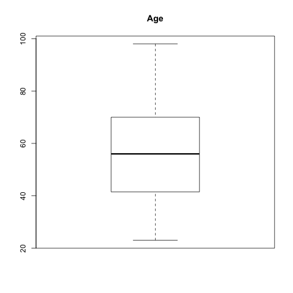
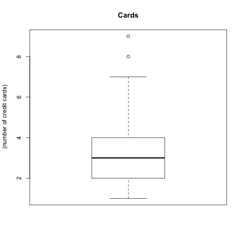
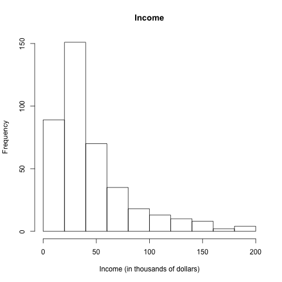
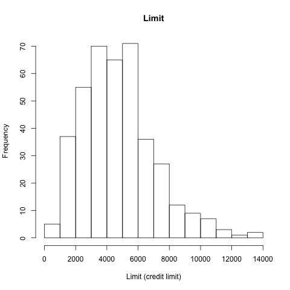
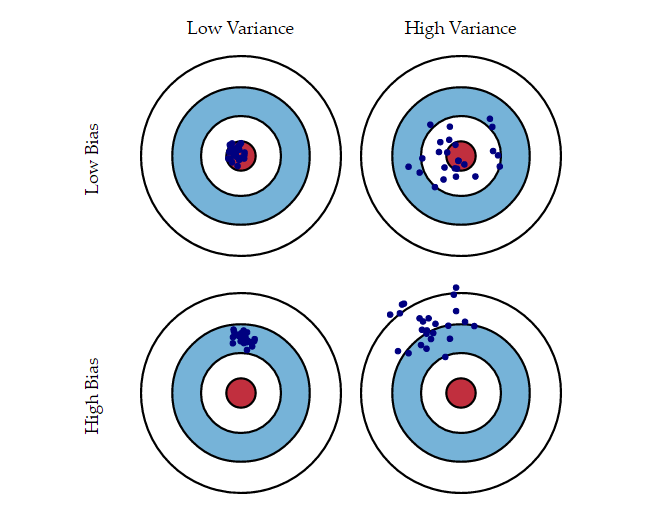

## Introduction
We reproduce content from the book _Introduction to Statistical Learning_ by Hastie, Tibshirani, James, and Witten, which discusses four penalized regression algorithms, fits these models to data, and evaluates results. 


# Data

## The Credit Dataset

- We use a dataset called `Credit`, which the authors have made available publically online for purposes of reproduction: http://www-bcf.usc.edu/~gareth/ISL/data.html

- The dataset has 11 predictors for 1 response, `Balance`.


## Quantitaive Variables

We have six quantitative variables:  
* `age`  
* `balance` (our response)
* `cards` (number of credit cards)  
* `education` (years of education)  
* `income`(in thousands of dollars)  
* `limit` (credit limit)  
* `rating` (credit rating) 


## Quantitative Variables

This is a __scatterplot matrix__ of their distributions: 


## Quantitative Variables

Along with some __boxplots__ and __histograms__ of specific predictors:

 

## Quantitative Variables


## Quantitative Variables


## Quantitative Variables



## Qualitative Variables

We have four qualitative variables:  
* `gender`  (m/f)  
* `student` (yes/no)    
* `married` (yes/no)    
* `ethnicity`(caucasian/asian/african american)    

All of these variables are factors with two or three levels, so the best way to explore their distribution is through frequency tables and plots that display `Balance` with respect to a qualitative variable.

## Qualitative Variables

Here are some visualizations:


## Qualitative Variables


## Qualitative Variables

We can also use these factors to make conditional boxplots of our response, `Balance`:


## Qualitative Variables


# Methodology

## Improving the Linear Model

- The goal of modeling data is to be able to predict future observations with high accuracy and minimal error. 
- A model's prediction error comes from three sources: 
  - Random error
  - Bias 
    - Measures how far off a model's prediction is from the correct value 
  - Variance
    - Measures of how much the predictions for a given point vary between different realizations of the model
    
## Improving the Linear Model | A visualization of prediction error due to bias and variance
<div class="centered">


## Improving the Linear Model | (continued)
The linear model with several explanatory variables is given by the equation: 
$$ Y = \beta_0 + \beta_1X_1 + ... + \beta_pX_p + \epsilon, $$
and we define our parameter space to be _n_ observations of _p_ predictors.  

## Improving the Linear Model | (continued)
- The Least Squares model has low bias and low variance when _n_ >> _p_ 
  - We have many more observations than predictors
- However, when _n_ > _p_ the Least Squares model overfits the data and has high variance
  - We have more observations than parameters, but not a lot more
- If _p_ > _n_, a unique Least Squares solution cannot be found

## Improving the Linear Model | (continued)
To correct for these problems,  statisticians have developed algorithms for _Shrinkage_ (for cases where _n_ > _p_) and _Dimensionality Reduction_ (for cases where _p_ is relatively large compared to _n_). 


##Shrinkage

To reduce variance we fit a model containing all _p_ predictors using a technique that shrinks coefficient estimates towards zero by adding an additional optimization contraint called a _shrinkage penalty_. 

##Ridge Regression {.smaller} 

Recall that the Least Squares model aims to minimize Residuals Sum of Squares, defined as: 

$$ RSS = \sum_{i = 1}^n (y_i - \beta_0 - \sum_{j = 1}^p \beta_jx_{ij})^2$$

Ridge Regression is a penalized linear least-squares model whose tuning parameter $\lambda$ controls the impact of its shrinkage penalty. 

The coeffiecient estimates of Ridge Regression, $\hat{\beta_{RIDGE}}$ minimize the RSS + a shrinkage penalty:

$$RSS + \lambda\sum_{j=1}^p \beta_j^2$$.

As $\lambda \rightarrow \infty$ the severity of the penalty increases, allowing us to select a lambda to create the most accurate model. We use Cross Validation to tune our parameter (this method is discussed later).

##LASSO Regression {.smaller}

Least Absolute Shrinkage and Selection Operator, commonly called LASSO, has the same algorithm as Ridge Regression, but while Ridge Regression adds an $L_2$ norm as an optimization contraint, LASSO uses an $L_1$ norm. This has the effect of requiring certain coefficients to be shrunk to _exactly_ 0 for significantly large values of $\lambda$, performing shrinkage and variable selection simulataneously. 

Specifically, LASSO minimizes the following quantity:

$$RSS + \lambda\sum_{j=1}^p |\beta_j|$$.

Like Ridge Regression, the tuning parameter can be optimally selected using Cross Validation.

##Cross Validation
- To select the best value of $\lambda$ we select a grid of values, compute coefficients for each value, and compute a measure of error
- We select the $lambda$ that minimizes the cross-validation error (there is some flexibility of this measure; often Mean Squared Error is used) and use this value of our tuning parameter to fit our final model 
- There are actually different forms of cross-validation used by statisticians; in this project we use the method discussed above, called _n-fold_ cross-validation, where _n_ is traditionally at least 10.


##Comparing Ridge Regression with LASSO {.smaller}
- While LASSO is by far more popular than Ridge Regression in industry due to sparsity of the LASSO model and its ease of interpretability, it does not always outperform Ridge Regression
- Both methods __reduce variance__, so as $\lambda$ increases the model variance decreases, but due to the _Bias-Variance Tradeoff_, the bias increases 
- LASSO often has slightly higher bias than does Ridge Regression
- It also is inaccurate in scenarios where no coefficient is truly zero - as it, every predictor is somewhat significant
- Thus, while it is often tempting to simply run LASSO on data, it is important to consider fitting Ridge Regression or to use Elastic-Net Regression, a combination of Ridge and LASSO


##Dimensionality Reduction
In situations where p is relatively large compared to n (there are many predictors per response), Least Squares fails to fit a unique linear model to the data and often overfits predictions. It thus becomes imperative to somehow reduce the dimensionality of our data while losing as little information as possible. We will discuss two regression algorithms that derive low-dimensional feature spaces from data before fitting a linear model.

##Principal Component Regression
- The first step of Principal Component Regression is the step of dimensionality reduction, Principal Componenet Analysis (PCA)
- A popular visualization tool, PCA allows us to view our data as principal components, or vectors that capture the majority of the variance between observations
- The process of PCA is mathematically Singular Value Decomposition. Principal components are generated by recursively projecting data in the direction that shows the maximum variance between observations; the first PC has the most variance, followed by the second, and so on

##Principal Component Regression | (continued)
Principal Component Regression constructs $M$ principal components as predictors and then fits a linear model using the Least Squares method. The idea is that only a few principal components are needed to capture the majority of the variance explained by the data, and that fitting M principal components to a linear model will not overfit the data as would Least Squares regression will all _p_ predictors. 


##Partial Least Squares Regression 
Partial Least Squares Regression (PLSR) is a supervised version of PCR, where the same M-dimensional space of linear combinations of data is used for predictors, but the response, Y, is used to identify directions that explain both the response and predictors.

##Partial Least Squares Regression | (continued)
- After standardizing the data, PLSR generates the first directional vector by computing correlation between the feature space and the calculated regression coefficient of Y regressed onto its predictors, thus placing the highest weight on the most correlated predictors
- The second direction is created by regressing each predictor onto the first direction and taking the residuals, which is information not explained by the first component
- The second direction is thus computed from these redsiduals 
- The next step is iterative; compute the third direction from residuals from a regression on the second component, and so on
- The final model fits Least Squares onto the computed directions

##When to reduce dimensions?
Typically, when there are many predictors with respect to the number of responses, dimensionality reduction is a good idea. 

However, not all datasets can be reduced to few principal components. As more principal components are used by a model, the bias decreases, but the variance naturally increases. Thus, a good indicator of the performance of PCR or PLSR would be a screeplot of the PCA-created principal components generated in the dimensionality-reduction step. A _screeplot_ plots the proportion of variance explained per componenent in a bar- or line-chart. 

##When to reduce dimensions? | (continued) {.smaller}
A good PCA has an "elbow" in its screeplot. Below are Principal Component Analyses of two different datasets: one is the popular "mtcars" dataset whose dimension is 32 rows by 11 columns. Another is a matrix of normally-distributed points of dimension 200 rows by 10 columns.


##When to reduce dimensions? | (continued)
Note that the first dataset has the majority of variance explained by three or four components, making it a good candidate for dimensionality reduction. 

The right-hand screeplot, however, does not have an "elbow", and requires many components to explain the variance between observation. Thus, PLSR or PCR may not perform well on this data.

## Evaluating Quality of Fit

To measure the quality of a fit model, we need to examine how well the model's predictions actually match the observed data. The most commonly used method to do this is through *mean squared error* (MSE), which is calculated for the training data as: 

$$MSE = \frac{1}{n}\sum_{n}^{i-1}(y_i-\hat{f}(x_i))^2$$ 

where $\hat{f}$ is a prediction of $f$, a function that describes the numerical relationship between a response variable $Y$ and its predictors $X_1, X_2, ..., X_n$. $\hat{f}(x_i)$ is then the prediction that $\hat{f}$ gives for the _i_ th observation. 

## Evaluating Quality of Fit | (continued) {.smaller}
Note, however, we are not truly examining whether $\hat{f}(x_i) \approx y_i$. Instead, we are examining whether $\hat{f}(x_0) \approx y_0$, where ($x_0$, $y_0$) is a previously unseen test observation that was not a part of the training data. For both formulations of the MSE, the result will be small if the predicted responses are very close to their true values, and will be very large if predicted and true responses differ substantially for some of the observations. 
  
-To determine the accuracy of the predictions that we obtain when we fit our model on 
previously unseen test data, we would choose the method that gives us the 
_lowest test MSE_ 
- To be specific, for a large number of test observations, we would 
compute  $Ave(y_0 - \hat{f}(x_0))^2,$ the average squared prediction error for test observations ($x_0$, $y_0$) 
- The model for which this calculated value is the lowest would then be best model overall to fit a dataset of interest

# Results
```{r, echo=F}
load("../data/regression/fit-pls.RData")
```


```{r, echo=F}
load("../data/regression/fit-pcr.RData")
```


```{r, echo=F, warning=F, message=F}
load("../data/regression/fit-lasso.RData")
```

```{r, echo=F}
load("../data/regression/fit-ridge.RData")
```


```{r, echo=F}
load("../data/regression/fit-ols.RData")
```


## Regression Coefficients


## Regression Coefficients | (continued)
All models had coefficients within a very close range, with no surprising or easily-spotted differences. In all fits the largest positive coefficient is `Limit`, and the largest negative coefficient is `Income`, meaning that regardless of model, these are the most significant predictors in our dataset. Our Ridge model set slightly higher coefficients for `Ranking` and `Married(Yes)`. The LASSO shrunk the predictors `Education`, `Gender`, `Married`, and `Ethnicity` to zero, while all other methods had very small coefficient values for these predictors. 

## Regression Coefficients | (continued)
Interestingly, all methods have very close MSE values, so it is not easy to select a best method. By lowest MSE our winner is Parial Least Squares Regression; however, re-fitting the model several times could result in slightly different prediction error rates for all method. Most importantly, all penalized regression methods out-performed Ordinary Least Squares, showing that for this dataset these methods did indeed improve the performance of a basic linear model.

# Conclusion

## Best Method(?)

Ultimately, we find that our best method is __Partial Least Squares Regression__ due to its having the smallest Mean Squared Error.
